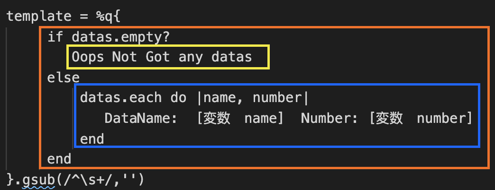

## ストリングワールド
---
ストリングはプログラミングの世界中にありふれる変数のタイプです。

Rubyのストリングと他のプログラミング言語と大体同じですが、
Rubyの世界でストリングはもっとダイナミックで変えやすいです。

Rubyの世界は物に意味を付与する方法が下記のようになっています。
```
変数名 = 値
aaa = 1 # => 一般の変数
AAA = 1 # => グローバル変数
```
>Rubyの世界で変数名は全部大文字の場合「グローバル変数」に定義できます。基本的には下記の三種類があります。

もっと勉強しましょ → [Ruby変数の種類と違い](https://qiita.com/tomokichi_ruby/items/a2548176d85457f622a4)

ちなみに、他のプログラミング言語はもっと丁寧の形になっています
例えC#は下記のようになっている
```
タイプ　変数名　= 値
```
さそく幾つ役に立つのAPIを見て試してみましょう！

### String#slice ストリングを切る
---
ストリングをスライスする時は、下記のAPIを使えばストリングの切り分けることができます。
```
AA="My first string"
puts AA.slice(3,5) # => 「first」
```
◆練習:stringworld_01.rb

> コードを運行した結果は「first」が表示されます
コードの視点は下記のように運行しています。
``` 
”My first string”.slice(3,5)
↓ ストリングからChar陣列に変換する
{'M','y',' ','f','i','r','s','t',' ','s','t','r','i','n','g'}
要素1　= 'M', 要素2 = 'y', 要素3 = ' '.....
↓ slice(3,5)
代入値1の3は要素3からスライスを行う意味です。
代入値2の5は要素3から五つ要素を取る意味です。
※APIごとにその実行の結果と代入値必要な数と意味も変わります。
```

「AA.slice(代入値1,代入値2)」について説明をします。
>スライス最初代入の値1は「3」です。その「3」の意味は"My first string"が「スライス」の方法を利用して、変数AAのストリングはCharの陣列として、そのchar陣列の中にの第3個目の値からスライスを行う意味です。

>スライスの二番目の代入値2の「5」は、幾つの要素を取るの意味であります。今回は五つ要素を取ります。

>補足：「ストリングからChar陣列に変換する」意味とは「"ABC"一つの単位」から複数の「{'A','B','C'}」のChar陣列になる意味である。

「AA.slice（start index,select chars from index）」AA.slice(開始場所, 開始場所から幾つの文字を取得する)

String#sliceに関して詳しいAPI内容はこちらへ → [String#slice](https://apidock.com/ruby/String/slice)


### String#upcase
---
ストリングは大文字に変更するAPIです。
```
aa="My string"
aa.upcase # => "MY STRING"
```
◆練習:stringworld_01.rb


### String#empty?
ストリングが空きかどうかを判断するAPIです。
```
aa.empty?   # => TRUE
aa="String" # => "String"
aa.empty?   # => FALSE
```
◆練習:stringworld_01.rb

### String#include?
ストリングが指定のストリングが含めているかどうかを判断するAPIです。
```
aa="String"        # => "String"
aa.include? 'A'    # => FALSE
aa.include? 'Str'  # => TRUE
aa.include? 'tri'  # => TRUE
aa.include? 'n'    # => TRUE
```
◆練習:stringworld_01.rb
## イテレーション (iterate)
---
### << で内容の増やす
Rubyのプログラミグ言語で、変数に要素を設定するや、追加するなどの方法は幾つがあって今回は「<<」の方法を紹介をします。

この「<<」方法はとても使いやすいが、使いすぎてコードが長くなってしまうことがしやすいから。
>常に、コードをシンプルにして綺麗な状態に維持することが心に留めてください。

ストリング変数を内容を増やす時は普段は「+」の方法で実現するですが、実際の「+」は「加算」の意味もあります。

そして、今回紹介したいの「<<」はアペンド（append）というの方法です。
```
aa="Abc"
aa << "DDD"
puts aa #=> "AbcDDD"
```
◆練習:stringworld_02.rb
### ストリングで他の変数を代入する
Rubyのプログラミング言語はストリングタイプで他の変数を差し込むことができます。このことは全部のプログラミング言語にもできますが、言語ごとに差し込むの方法もちょっと違いますよ。
```
number = 5
bb = "I Got #{number} " # => "I Got 5"

bb = "The number after #{number} is #{number.next} " # => "The number after 5 is 6"

bb = "The number before #{number} is #{number-1} " # => "The number before 5 is 4"

bb = "We're ##{number}!" # => "We're #5!"
```
◆練習:stringworld_02.rb

Api → [[ next ]](https://apidock.com/ruby/Integer/next)

### ストリングのエスケープ処理（escape processing）
>ストリングを使う時、もし「\」の次は[n]を続けて記されたら、その出力結果は[\n]じゃなくて「改行」になってしまった。

>どうして考え通りの[\n]の出力結果にならないのは「エスケープ処理」が発生しましたから。
```
puts "This is string \n good idea"
# => 出力結果
# line 1 "This is string "
# line 2 " good idea"
```
「エスケープ処理」を避けるために[\]の前にもう一つ[\\]を追加したら「エスケープ処理」を避けることができますよ。
```
puts "This is string \\n good idea"
# => 出力結果
# line 1 "This is string n good idea"
```

「エスケープ処理」とは、プログラミング言語やソフトウェアで文字列を扱う際に、特定の記号文字などに続けて記された文字（の並び）に、その文字本来の意味とは異なる特別な意味や機能を与えること。先頭の特殊な文字を「エスケープ文字」という。
もっと勉強しましょう → [エスケープ処理](http://e-words.jp/w/%E3%82%A8%E3%82%B9%E3%82%B1%E3%83%BC%E3%83%97%E5%87%A6%E7%90%86.html)

### ちょっと難しいコードを見てみましょう
```
hash = {"key"=>"v1","B"=>"v2"}
string =""
hash.each { |k,v| string << "#{k} is Key, #{v} is Value¥n" }
puts string
```
◆練習:stringworld_03.rb

まず「hash = {"key"=>"v1","B"=>"v2"}」の部分について説明します。
まずこの「"key"=>"v1"」部分だけ注目しましょう。

>ここの「=>」は区切りとして「左側の　key」と「右側の　v1」を分けました。「左側の部分はKEY」と呼ばれます、「右側は値」を呼ばれます、この状況は「ハッシュテーブル」という状況です。
>
>「[ハッシュテーブル](http://e-words.jp/w/%E3%83%8F%E3%83%83%E3%82%B7%E3%83%A5%E3%83%86%E3%83%BC%E3%83%96%E3%83%AB.html)」とは、データ構造の一つで、標識（キー：key）と対応する値（value）のペアを単位としてデータを格納し、キーを指定すると対応する値を高速に取得できる構造。
>
>・In Ruby what dose "=>" mean → [[=>]](https://stackoverflow.com/questions/4663074/in-ruby-what-does-mean-and-how-does-it-work)
>
>・[The Ruby Map Method](https://www.rubyguides.com/2018/10/ruby-map-method/)

次は「hash.each { |k,v| string << "#{k} is Key, #{v} is Value¥n" }」の部分を見ましょう。
>「[.each](https://apidock.com/ruby/v2_5_5/Enumerator/each)」の意味は変数陣列の要素を一つつずを取る意味です。
>
>波括弧の中に「|k,v|」の部分を見てください。
>ここの「|k,v|」は二つの変数をラムダ式で宣言する意味です。
>
>・最初の「k」は「Key」の変数名として宣言しています。
>・次の「v」は「Value」の変数名として宣言しています。

もっと勉強しましょう → [each_with_index](https://apidock.com/ruby/v2_5_5/Enumerator/each_with_index)
### ストリングの中にクラスを挟むまで可能!?
>Q：ストリングの中にこの前話した「#{}」の方法で[ラムダ式(nameless function)](https://ja.wikipedia.org/wiki/%E7%84%A1%E5%90%8D%E9%96%A2%E6%95%B0)のクラスを挟むことが可能でしょうか？

>A:可能です

使う時は下記のような形になっております。でも、普段コードを読みやすいために、下記ようなコードは必要じゃない場合は出来る限りに使わないでください。

```
puts "Here is #{
    class InstantClass 
        def bar
        "Some bar"
        end
    end
InstantClass.new.bar
}"

```

◆練習:stringworld_03.rb

### printf風で変数をストリングに代入する
Rubyのプログラミング言語はC言語とPython言語にある「printf」と似ているストリングの出力方法もできます。
```
template = 'This is %s'
puts template % 'apple' # => "This is apple"

puts 'To 2 decimal places: %.2f' % Math::PI
puts 'To 2 decimal places: %.5f' % Math::PI
puts 'To 2 decimal places: %d' % Math::PI
puts 'To 2 decimal places: %5d' % Math::PI
```
◆練習:stringworld_04.rb

まず、ストリング後に続けて記された「％」を見てください。
>template 「　%　」 'apple' ここの「％」です。
>
>※左側通称「テンプレート文章」、右側通称「代入用の値」

Rubyのプログラミング言語で「printf風」で変数をストリングに代入する時、まず二つの条件を足さないといけないです、他のプログラミングも大体同じ状況です。
 - 条件その1 : フォーマット専用の「テンプレートの文章」の準備
 - 条件その2 : フォーマットする時必要な「代入用の値」

以上この二つの条件を満たすと、文章の完成フォーマットすることができます。

もっと勉強しましょう → [フォーマットとは](http://e-words.jp/w/%E3%83%95%E3%82%A9%E3%83%BC%E3%83%9E%E3%83%83%E3%83%88.html)

もっと勉強しましょう → [C言語のフォ-マット式一覧](https://www.k-cube.co.jp/wakaba/server/format.html)

### Embedded Ruby(ERB)の方法で変数をストリングに代入する
Embedded Ruby(ERB)はRuby on Rails(RoRR)でWebサイドを開発する時、良く使っているテンプレートの表現です。

ERBのAPIを使う時、先頭のところで「[require](https://qiita.com/Rudiments/items/6c999b0ec5481fabf6a2)」の指定のAPIの使用請求を書かないと対応のAPIが使えないです。
```
require 'erb'
```
>「require」とは、要求、請求として理解すれば理解しやすくなったかな、つまり、あなたは他の力を借りる時の意味です。
>
>Q:「力を借りる」って、どういう意味なのか？
>
>A:プログラミング言語の世界中、多くの言語の開発者がいて、開発者から作った使いやすい重宝な関数や機能（総称:[ライブラリ](http://e-words.jp/w/%E3%83%A9%E3%82%A4%E3%83%96%E3%83%A9%E3%83%AA.html)）を借りて使う時のキーワードです。

Ruby以外のプログラミング言語で、言語ごとにAPIを借りて使う時専用のキーワールドも違います。例えば：「Import」、「Using」等等。

まず簡単の範例を見ましょう
```
require 'erb'
template = ERB.new %q{I Got <%= item %>!}
```
ERBの使い方について説明します。まずはテンプレート文章の作成部分を見ましょう。
>　ERB.new %q{I Got <%= item %>!}　# これは今回のテンプレート文章です。

>ERB.new %q{} # 空っぽの時はこの感じです。

>{I Got <%= item %>!}　波括弧中にある文章は今回のテンプレートの文章です。

>そして！！　入れ替え用の変数の定義方法は「<%= item %>」です！

ERBのテンプレートの文章を書く時、変数とのつなぎ方法は「<%= 変数名 %>」です。

このような形でテンプレートを書き上げた後、指定の「合成/
更新」の関数を呼び出すとテンプレート文章中にの入り換え用の変数は自動的にその変数の値に切り替える。

```
require 'erb'
template = ERB.new %q{I Got <%= item %>!}
item = "Orange"　# => 入り換え用の変数は値を付与する
puts template.result　# =>　合成/更新の関数を利用する
item = "Box"　　　# =>　また、値を変更して
puts template.result　# =>　もう一度合成/更新の関数を利用する
```
ERBで作ったテンプレートは「resultで合成/更新」ができますが、この「result」の方法は自動的に出力がしません。もし、「puts」を頼らずに直接「合成/更新して出力」ことが欲しいの場合は「run」の関数を使うと望むの結果が出せます。

### ちょっと難しいEmbedded Ruby(ERB)の範例
```
require 'erb'
template = %q{
    <% if datas.empty? %>
        Oops Not Got any datas
    <% else %>
        <% datas.each do |name, number| %>
            DataName: <%= name %> Number: <%= number%>
        <% end %>
    <% end %>
}.gsub(/^\s+/,'')

template = ERB.new(template, nil, '<>')

datas = [
            ["Andy","112255-554"],
            ["Mery","333345-664"],
        ]

template.run
datas = []
puts ' result ? ======'
template.result
puts ' out put ?======'
puts template.result
template.run
```
この範例について、二つのパーツに分解して分けて見ましょう
- その1 テンプレートの文章
```
template = %q{
    <% if datas.empty? %>
        Oops Not Got any datas
    <% else %>
        <% datas.each do |name, number| %>
            DataName: <%= name %> Number: <%= number%>
        <% end %>
    <% end %>
}.gsub(/^\s+/,'')
```
この文章をもっとわかりやすいために全部の「<% %>」を外しましょう
```
template = %q{
     if datas.empty? 
        Oops Not Got any datas
     else 
         datas.each do |name, number| 
            DataName:  [変数　name]  Number: [変数　number]
         end 
     end 
}.gsub(/^\s+/,'')
```
もし、過去Rubyを書いたことがある方は多分もう既に現状を把握したと思いますが、もう一度復習しましょう！
Ruby言語は普段関数や判断式を書く時最後は必ず「end」で関数や判断式の終了を記する。

下の画像をじっくり見ると三つのブロックがあります。
- 全体一番デカイ「オレンジ色のブロック」は「ifとelse」のメインブロックである。
- ifが成立する時入るの「黄色ブロック」、ここは条件が満ちる時やるべきの処理です。
- ifが不成立時入るの「青いブロック」、このブロックは条件が満たない時対応するべきの処理です。

>「.gsub(/^\s+/,'')」の部分に関して説明します。
[String#gsub](https://apidock.com/ruby/String/gsub)はストリング専用のAPIの「Grep & Replace」の意味です。簡単でいうと指定のストリングで決めた文字を取得して、指定のストリングで書き換えることです。
>
>gsub(選定文字,書き換えの文字)
>
>今回この部分は「正規表現」というの方法で複数の空白を取って、何もない文字を書き換えるです。その「複数の空白を取る」の正規表現は「/^\s+/」です。ここの「s+」の意味は「複数の空白」の意味である。

⭐️⭐️⭐️正規表現の汎用性はRubyだけではなくて、他のプログラミング言語にも使えるよ。
「正規表現」って主に資料を処理する時、簡単な「正規表現」の文字フィルターコードを書いて、そのフィルターを使って複雑な資料中から欲しいデータを簡単に引き出すことができます。

その部分は一番重要な知識と技術と思っています。特にRubyで膨大の資料や自動化処理をする時、もし自分が「正規表現」の技術が持っていたら、もっとシンプルで効率なコードを書けれるから、時間を節約するために是非覚えてみて下さい。

もっと勉強しましょう → [正規表現(regular expression)とは](http://e-words.jp/w/%E6%AD%A3%E8%A6%8F%E8%A1%A8%E7%8F%BE.html)

もっと勉強しましょう → [正規表現](https://qiita.com/jnchito/items/893c887fbf19e17d3ff9)

- その2 テンプレートの合成と出力
```
# =>　以上は　その1　の省略...

template.run　# => テンプレートの合成と出力
datas = []　　# => 書き換え用の変数の値変化
puts ' result ? ======'　
template.result　# => テンプレートの合成のみ、putsを利用しないと出力がしません
puts ' out put ?======'
puts template.result # => putsを使って通常で出力する
template.run　# => テンプレートの合成と出力
```

◆練習:stringworld_04.rb