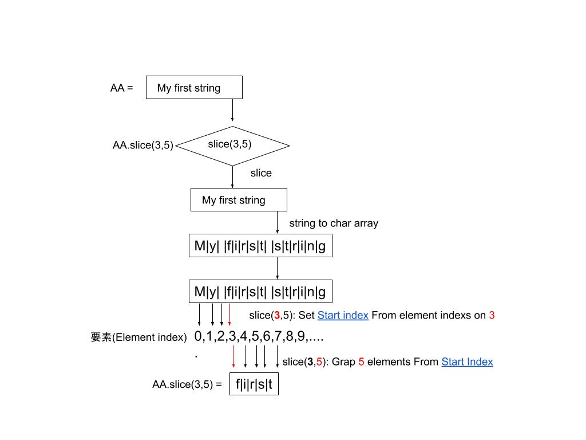

## ストリングワールド
---
ストリングはプログラミングの世界中にありふれる変数のタイプです。

Rubyのストリングと他のプログラミング言語と大体同じですが、
Rubyの世界でストリングはもっとダイナミックで変えやすいです。

Rubyの世界は物に意味を付与する方法が下記のようになっています。
```
変数名 = 値
```

ちなみに、他のプログラミング言語はもっと丁寧の形になっています
例えC#は下記のようになっている
```
タイプ　変数名　= 値
```
さそく幾つ役に立つのAPIを見て試してみましょう！

### String#slice ストリングを切る
---
ストリングをスライスする時は、下記のAPIを使えばストリングの切り分けることができます。
```
AA="My first string"
puts AA.slice(3,5) # => 「first」
```

> コードを運行した結果は「first」が表示されます
コードの視点は下記のように運行しています。
``` 
”My first string”.slice(3,5)
↓ ストリングからChar陣列に変換する
{'M','y',' ','f','i','r','s','t',' ','s','t','r','i','n','g'}
要素1　= 'M', 要素2 = 'y', 要素3 = ' '.....
↓ slice(3,5)
代入値1の3は要素3からスライスを行う意味です。
代入値2の5は要素3から五つ要素を取る意味です。
※APIごとにその実行の結果と代入値必要な数と意味も変わります。
```

「AA.slice(代入値1,代入値2)」について説明をします。
>スライス最初代入の値1は「3」です。その「3」の意味は"My first string"が「スライス」の方法を利用して、変数AAのストリングはCharの陣列として、そのchar陣列の中にの第3個目の値からスライスを行う意味です。

>スライスの二番目の代入値2の「5」は、幾つの要素を取るの意味であります。今回は五つ要素を取ります。

>補足：「ストリングからChar陣列に変換する」意味とは「"ABC"一つの単位」から複数の「{'A','B','C'}」のChar陣列になる意味である。

「AA.slice（start index,select chars from index）」AA.slice(開始場所, 開始場所から幾つの文字を取得する)

String#sliceに関して詳しいAPI内容はこちらへ→[String#slice](https://apidock.com/ruby/String/slice)


### String#upcase
---
ストリングは大文字に変更するAPIです。
```
AA="My string"
AA.upcase # => "MY STRING"
```

### String#empty?
ストリングが空きかどうかを判断するAPIです。
```
AA.empty?   # => TRUE
AA="String" # => "String"
AA.empty?   # => FALSE
```

### String#include?
ストリングが指定のストリングが含めているかどうかを判断するAPIです。
```
AA="String"        # => "String"
AA.include? 'A'    # => FALSE
AA.include? 'Str'  # => TRUE
AA.include? 'tri'  # => TRUE
AA.include? 'n'    # => TRUE
```
## イテレーション (iterate)
---
### << で内容の増やす
Rubyのプログラミグ言語で、変数に要素を設定するや、追加するなどの方法は幾つがあって今回は「<<」の方法を紹介をします。

この「<<」方法はとても使いやすいが、使いすぎてコードが長くなってしまうことがしやすいから。
>常に、コードをシンプルにして綺麗な状態に維持することが心に留めてください。

ストリング変数を内容を増やす時は普段は「+」の方法で実現するですが、実際の「+」は「加算」の意味もあります。

そして、今回紹介したいの「<<」はアペンド（append）というの方法です。
```
AA="Abc"
AA << "DDD"
puts AA #=> "AbcDDD"
```